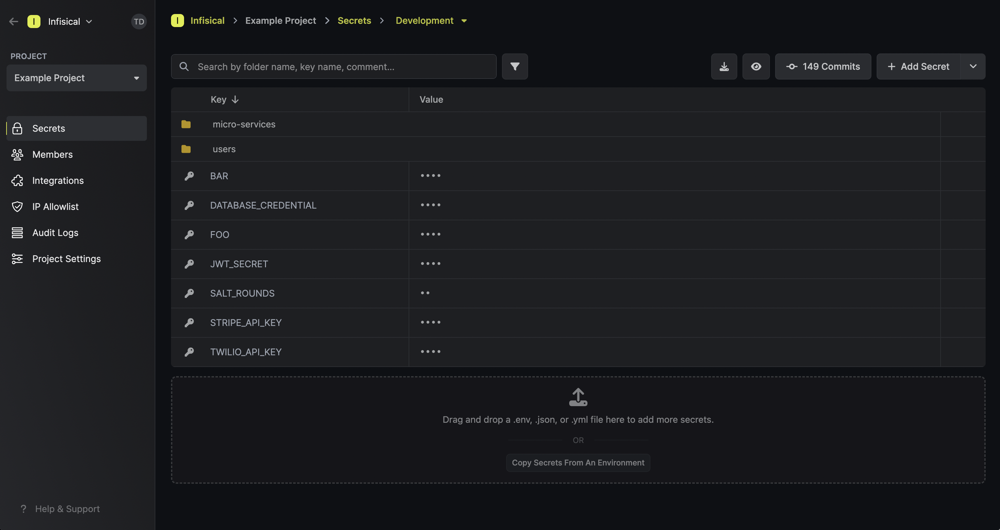

## Self-hosted

If you're using a self-hosted installation, follow the [setup](/self-hosting/overview) then open your site URL `{SITE_URL}`.

## Gsoc2 Cloud

Open [gsoc2.com](https://gsoc2.com/) and click on either "Try Gsoc2 for free" or "Start for free" to complete the signup sequence.

Once you've done that, you'll be taken to the dashboard where we've populated some default environment variables for demonstration.

