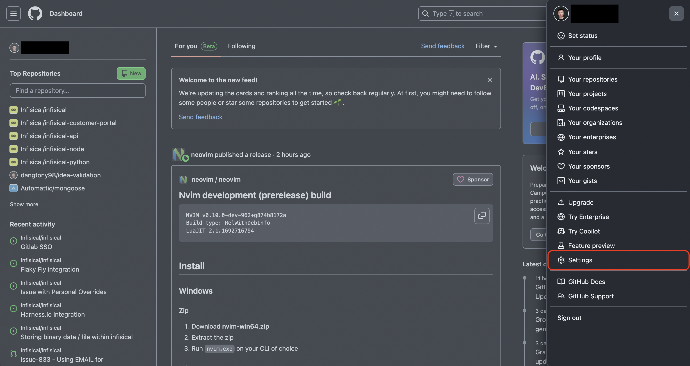
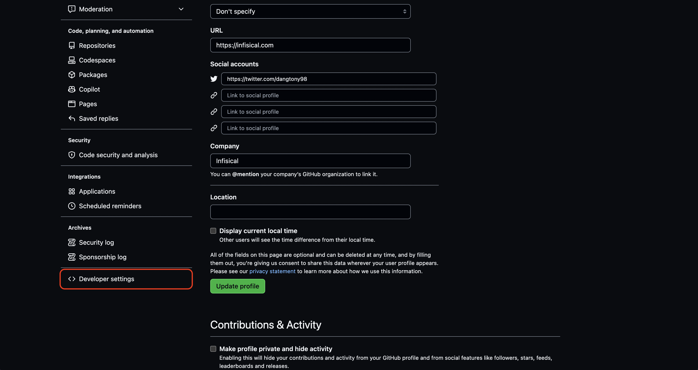
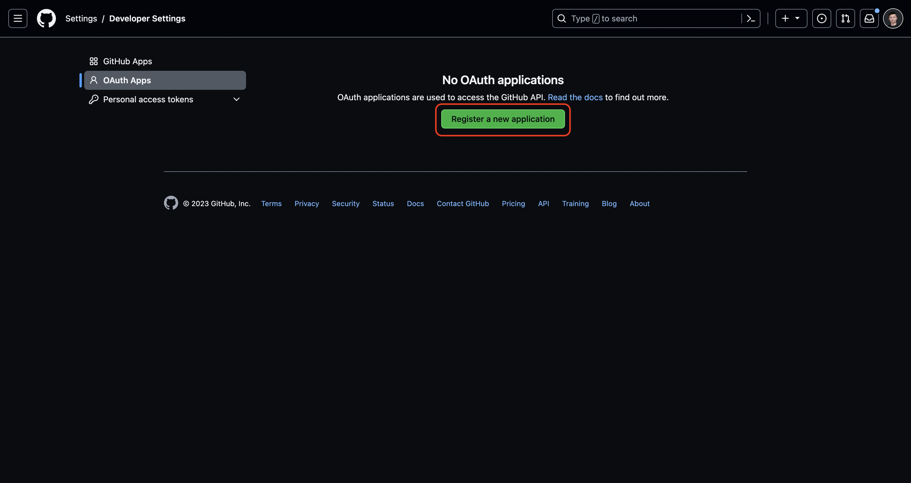
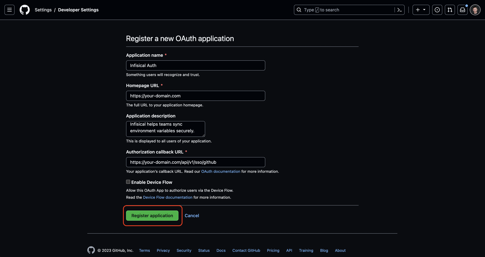
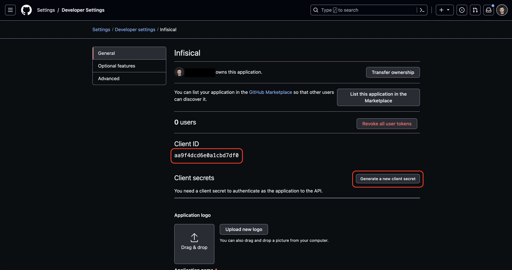

Using GitHub SSO on a self-hosted instance of Gsoc2 requires configuring an OAuth2 application in GitHub and registering your instance with it.

## Create an OAuth application in GitHub

Navigate to your user Settings > Developer settings > OAuth Apps to create a new GitHub OAuth application.

Create the OAuth application. As part of the form, set the **Homepage URL** to your self-hosted domain `https://your-domain.com`
and the **Authorization callback URL** to `https://your-domain.com/api/v1/sso/github`.

<Note>
    If you have a GitHub organization, you can create an OAuth application under it
    in your organization Settings > Developer settings > OAuth Apps > New Org OAuth App.
</Note>

## Add your OAuth application credentials to Gsoc2

Obtain the **Client ID** and generate a new **Client Secret** for your GitHub OAuth application.

Back in your Gsoc2 instance, make sure to set the following environment variables:

- `CLIENT_ID_GITHUB_LOGIN`: The **Client ID** of your GitHub OAuth application.
- `CLIENT_SECRET_GITHUB_LOGIN`: The **Client Secret** of your GitHub OAuth application.
- `JWT_PROVIDER_AUTH_SECRET`: A secret key used for signing and verifying JWT. This could be a randomly-generated 256-bit hex string.
- `SITE_URL`: The URL of your self-hosted instance of Gsoc2 - should be an absolute URL including the protocol (e.g. https://app.gsoc2.com)
   
Once added, restart your Gsoc2 instance and log in with GitHub.

## FAQ

<AccordionGroup>
  <Accordion title="Why is GitHub SSO not working?">
    It is likely that you have misconfigured your self-hosted instance of Gsoc2. You should:

    - Check that you have set the `CLIENT_ID_GITHUB_LOGIN`, `CLIENT_SECRET_GITHUB_LOGIN`, 
    `JWT_PROVIDER_AUTH_SECRET`, and `SITE_URL` environment variables.
    - Check that the **Authorization callback URL** specified in GitHub matches the `SITE_URL` environment variable.
    For example, if the former is `https://app.gsoc2.com/api/v1/sso/github` then the latter should be `https://app.gsoc2.com`.
  </Accordion>
</AccordionGroup>