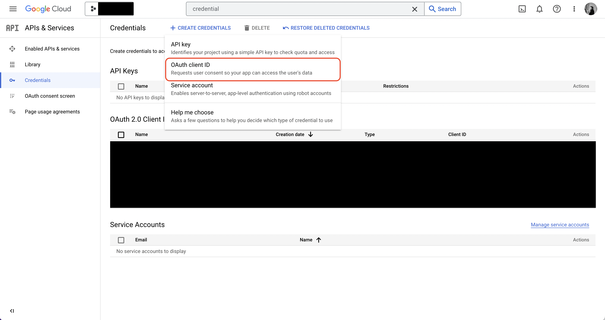
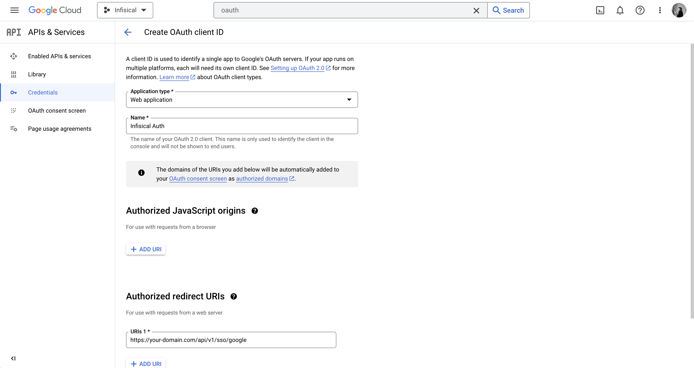
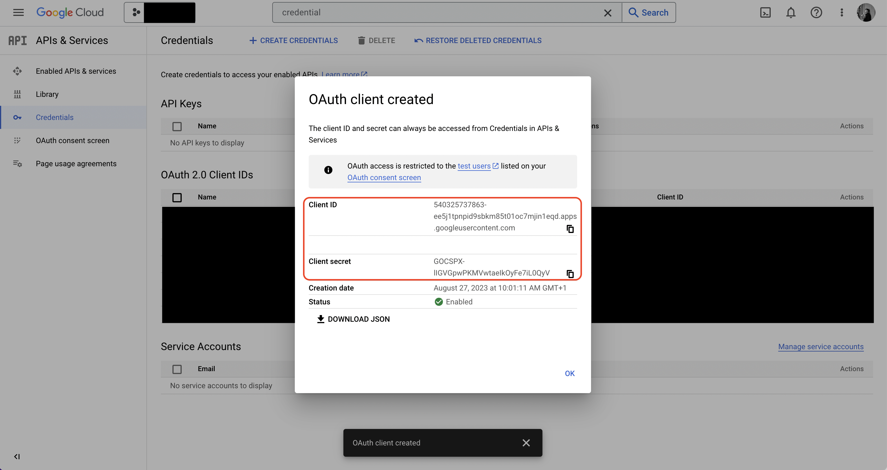

Using Google SSO on a self-hosted instance of Gsoc2 requires configuring an OAuth2 application in GCP and registering your instance with it.

## Create an OAuth2 application in GCP

Navigate to your project API & Services > Credentials to create a new OAuth2 application.
    

Create the application. As part of the form, add to **Authorized redirect URIs**: `https://your-domain.com/api/v1/sso/google`.

## Add your OAuth2 application credentials to Gsoc2
   
Obtain the **Client ID** and **Client Secret** for your GCP OAuth2 application.

   
Back in your Gsoc2 instance, make sure to set the following environment variables:

- `CLIENT_ID_GOOGLE_LOGIN`: The **Client ID** of your GCP OAuth2 application.
- `CLIENT_SECRET_GOOGLE_LOGIN`: The **Client Secret** of your GCP OAuth2 application.
- `JWT_PROVIDER_AUTH_SECRET`: A secret key used for signing and verifying JWT. This could be a randomly-generated 256-bit hex string.
- `SITE_URL`: The URL of your self-hosted instance of Gsoc2 - should be an absolute URL including the protocol (e.g. https://app.gsoc2.com)
   
Once added, restart your Gsoc2 instance and log in with Google

## FAQ

<AccordionGroup>
  <Accordion title="Why is Google SSO not working?">
    It is likely that you have misconfigured your self-hosted instance of Gsoc2. You should:

    - Check that you have set the `CLIENT_ID_GOOGLE_LOGIN`, `CLIENT_SECRET_GOOGLE_LOGIN`, 
    `JWT_PROVIDER_AUTH_SECRET`, and `SITE_URL` environment variables.
    - Check that the **Authorized redirect URI** specified in GCP matches the `SITE_URL` environment variable.
    For example, if the former is `https://app.gsoc2.com/api/v1/sso/google` then the latter should be `https://app.gsoc2.com`.
  </Accordion>
</AccordionGroup>