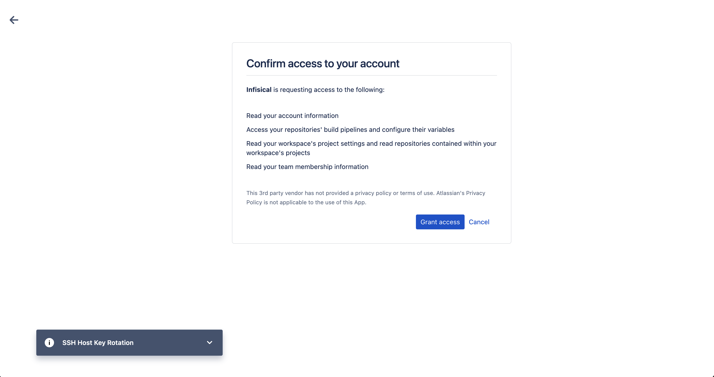
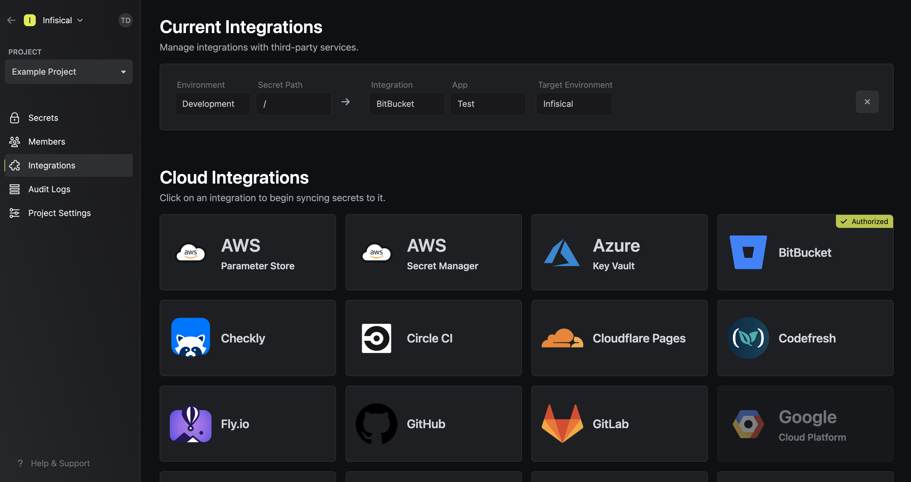

Prerequisites:

- Set up and add envars to [Gsoc2 Cloud](https://app.gsoc2.com)

## Navigate to your project's integrations tab

## Authorize Gsoc2 for Bitbucket

Press on the Bitbucket tile and grant Gsoc2 access to your Bitbucket account.

<Info>
  If this is your project's first cloud integration, then you'll have to grant
  Gsoc2 access to your project's environment variables. Although this step
  breaks E2EE, it's necessary for Gsoc2 to sync the environment variables to
  the cloud platform.
</Info>

## Start integration

Select which Gsoc2 environment secrets you want to sync to which Bitbucket repo and press start integration to start syncing secrets to the repo.

