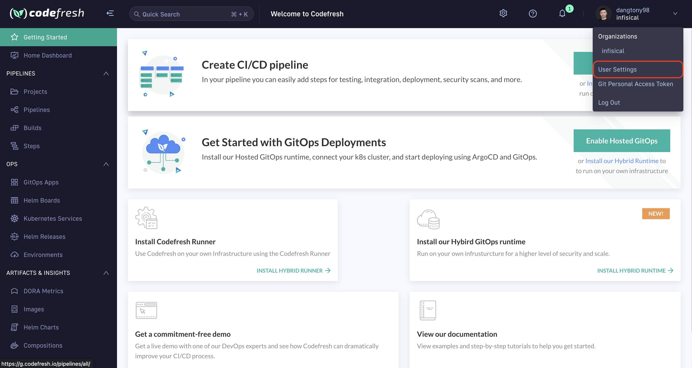
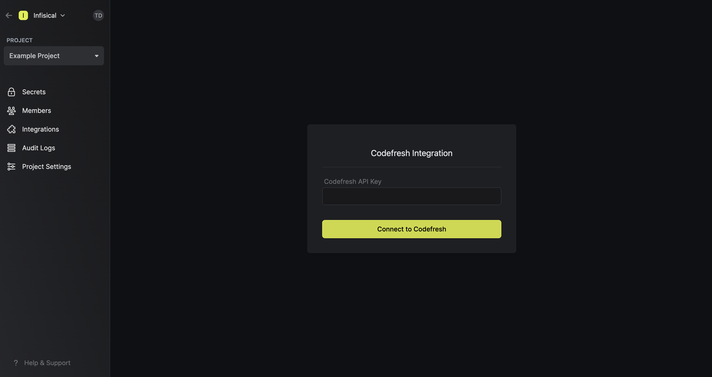
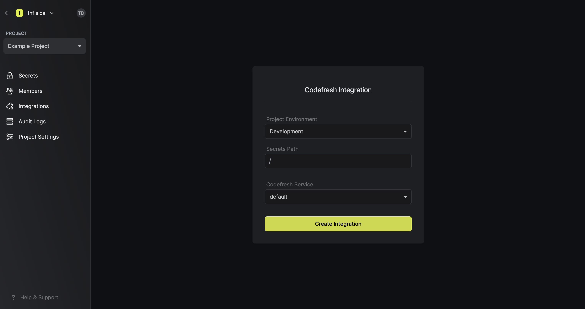
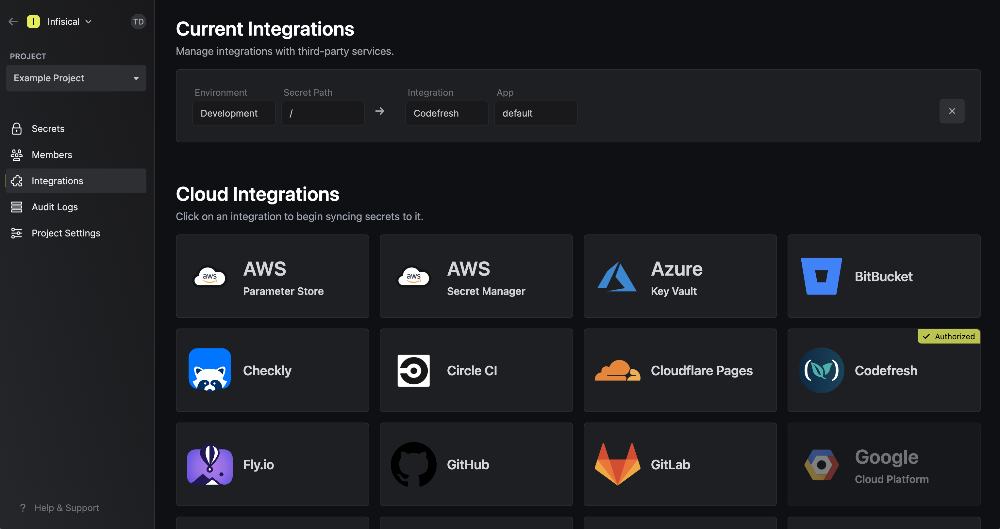

Prerequisites:

- Set up and add envars to [Gsoc2 Cloud](https://app.gsoc2.com)

## Navigate to your project's integrations tab

## Authorize Gsoc2 for Codefresh

Obtain an API key in User Settings > API Keys

Press on the Codefresh tile and input your Codefresh API key to grant Gsoc2 access to your Codefresh account.

<Info>
  If this is your project's first cloud integration, then you'll have to grant
  Gsoc2 access to your project's environment variables. Although this step
  breaks E2EE, it's necessary for Gsoc2 to sync the environment variables to
  the cloud platform.
</Info>

## Start integration

Select which Gsoc2 environment secrets you want to sync to which Codefresh service and press create integration to start syncing secrets to Codefresh.

