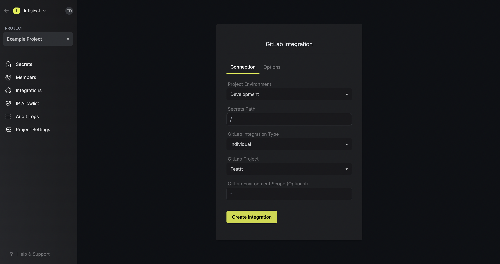
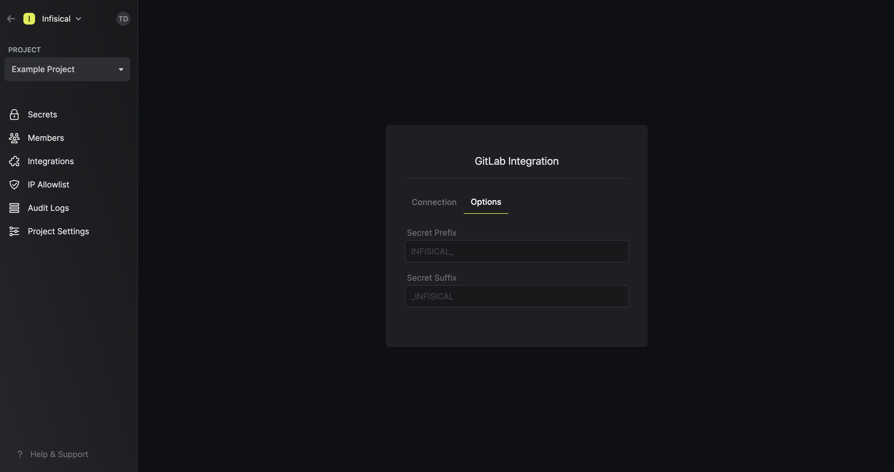
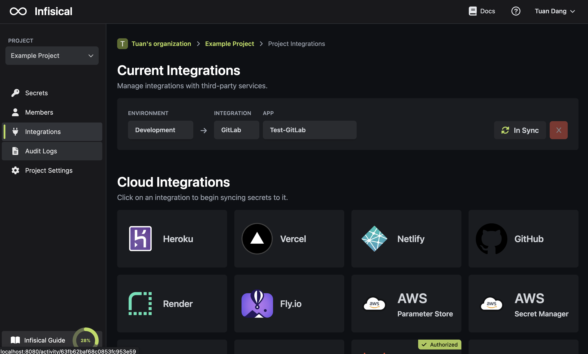
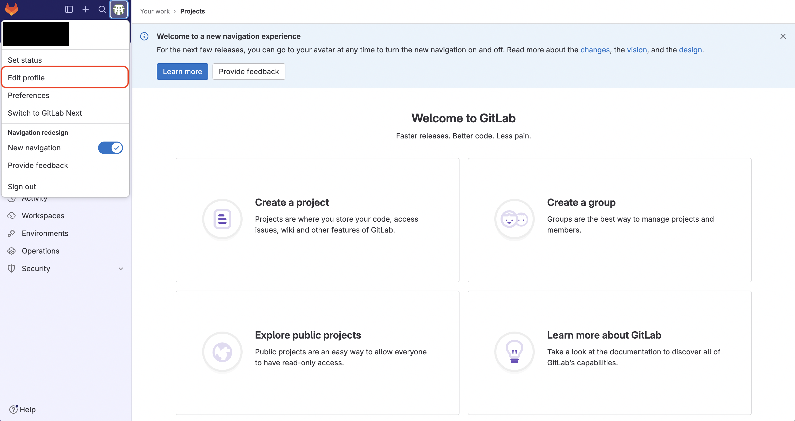
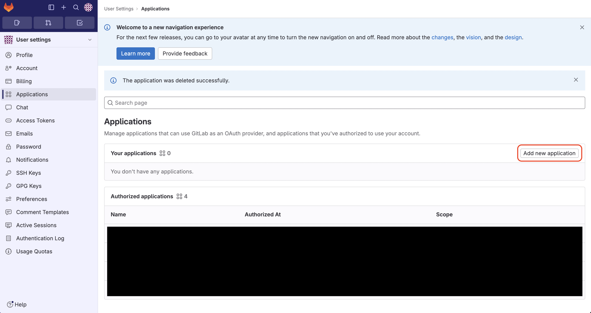
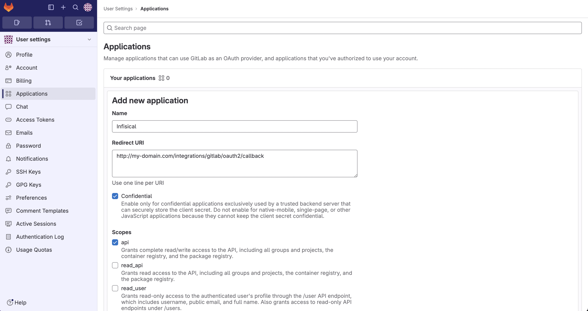
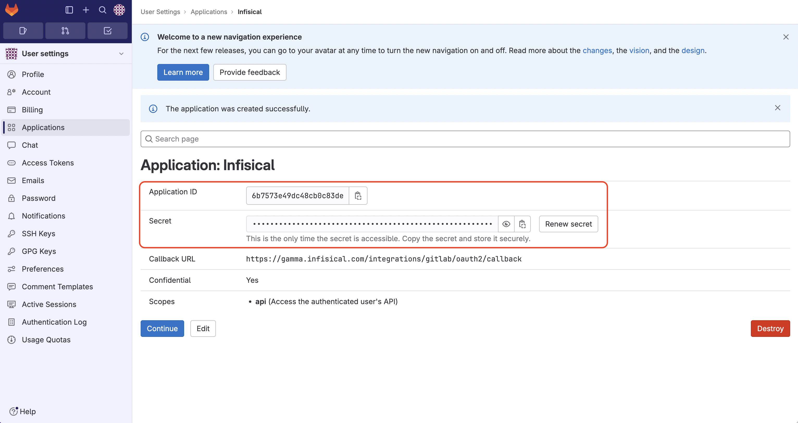

<Tabs>
  <Tab title="Usage">
  Prerequisites:

- Set up and add envars to [Gsoc2 Cloud](https://app.gsoc2.com)

<AccordionGroup>
  <Accordion title="Standard">
  ## Navigate to your project's integrations tab


## Authorize Gsoc2 for GitLab

Press on the GitLab tile and grant Gsoc2 access to your GitLab account.


<Info>
  If this is your project's first cloud integration, then you'll have to grant
  Gsoc2 access to your project's environment variables. Although this step
  breaks E2EE, it's necessary for Gsoc2 to sync the environment variables to
  the cloud platform.
</Info>
## Start integration

Select which Gsoc2 environment secrets you want to sync to which GitLab repository and press create integration to start syncing secrets to GitLab.



Note that the GitLab integration supports a few options in the **Options** tab:

- Secret Prefix: If inputted, the prefix is appended to the front of every secret name prior to being synced.
- Secret Suffix: If inputted, the suffix to appended to the back of every name of every secret prior to being synced.

Setting a secret prefix or suffix ensures that existing secrets in GCP Secret Manager are not overwritten during the sync. As part of this process, Gsoc2 abstains from mutating any secrets in GitLab without the specified prefix or suffix.




  </Accordion>
  <Accordion title="Pipeline">
  ## Generate service token

Generate an [Gsoc2 Token](/documentation/platform/token) for the specific project and environment in Gsoc2.

## Set the Gsoc2 Token in Gitlab

Create a new variable called `GSOC2_TOKEN` with the value set to the token from the previous step in Settings > CI/CD > Variables of your GitLab repository.

## Configure Gsoc2 in your pipeline

Edit your `.gitlab-ci.yml` to include the Gsoc2 CLI installation. This will allow you to use the CLI for fetching and injecting secrets into any script or command within your Gitlab CI/CD process.

#### Example

```yaml
image: ubuntu

stages:
  - build
  - test
  - deploy

build-job:
  stage: build
  script:
    - apt update && apt install -y curl
    - curl -1sLf 'https://dl.cloudsmith.io/public/gsoc2/gsoc2-cli/setup.deb.sh' | bash
    - apt-get update && apt-get install -y gsoc2
    - gsoc2 run -- npm run build
```
  </Accordion>
</AccordionGroup>
  </Tab>
  <Tab title="Self-Hosted Setup">
  Using the GitLab integration on a self-hosted instance of Gsoc2 requires configuring an application in GitLab
  and registering your instance with it.

  ## Create an OAuth application in GitLab
    
    Navigate to your user Settings > Applications to create a new GitLab application.
   
    
    
    
    Create the application. As part of the form, set the **Redirect URI** to `https://your-domain.com/integrations/gitlab/oauth2/callback`.

    
   
    <Note>
      If you have a GitLab group, you can create an OAuth application under it
      in your group Settings > Applications.
    </Note>
   
   ## Add your OAuth application credentials to Gsoc2
   
   Obtain the **Application ID** and **Secret** for your GitLab application.
   
    
   
   Back in your Gsoc2 instance, add two new environment variables for the credentials of your GitLab application:

   - `CLIENT_ID_GITLAB`: The **Client ID** of your GitLab application.
   - `CLIENT_SECRET_GITLAB`: The **Secret** of your GitLab application.
   
  Once added, restart your Gsoc2 instance and use the GitLab integration.
  
  </Tab>
</Tabs>

