Prerequisites:

- Set up and add secrets to [Gsoc2](https://app.gsoc2.com).
- You have a working Jenkins installation with the [credentials plugin](https://plugins.jenkins.io/credentials/) installed.
- You have the Gsoc2 CLI installed on your Jenkins executor nodes or container images.

## Add Gsoc2 Service Token to Jenkins

After setting up your project in Gsoc2 and adding the Gsoc2 CLI to container images, you will need to add the Gsoc2 Service Token to Jenkins. Once you have generated the token, browse to **Manage Jenkins > Manage Credentials** in your Jenkins installation.

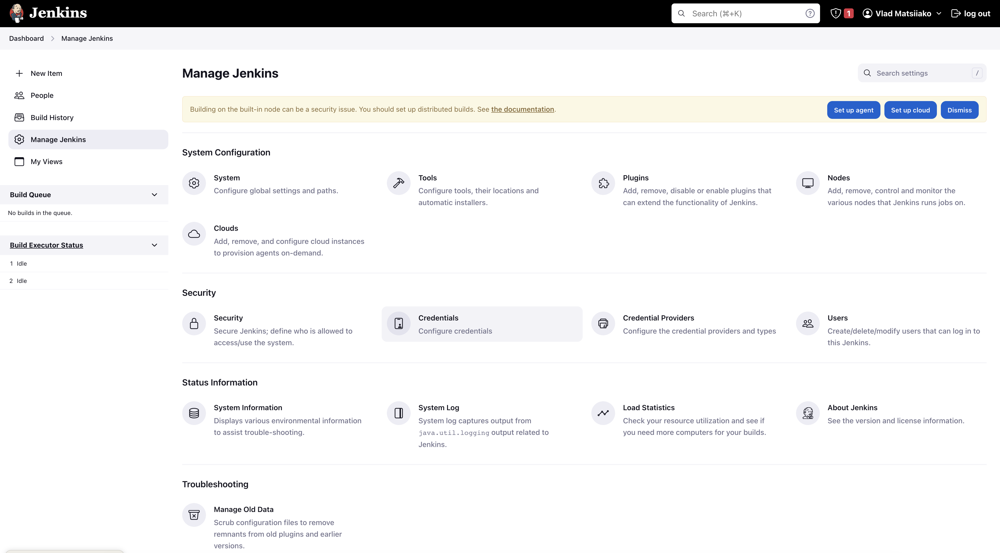

Click on the credential store you want to store the Gsoc2 Service Token in. In this case, we're using the default Jenkins global store.

<Info>
  Each of your projects will have a different GSOC2_SERVICE_TOKEN though.
  As a result, it may make sense to spread these out into separate credential domains depending on your use case.
</Info>

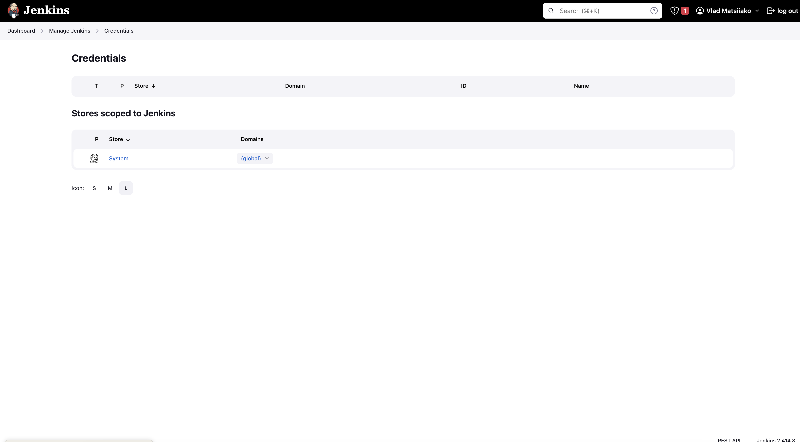

Now, click Add Credentials.

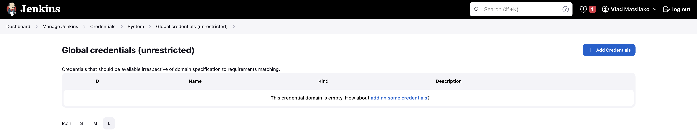

Choose **Secret text** from the **Kind** dropdown menu, paste the Gsoc2 Service Token into the **Secret** field, enter `GSOC2_SERVICE_TOKEN` into the **Description** field, and click **OK**.

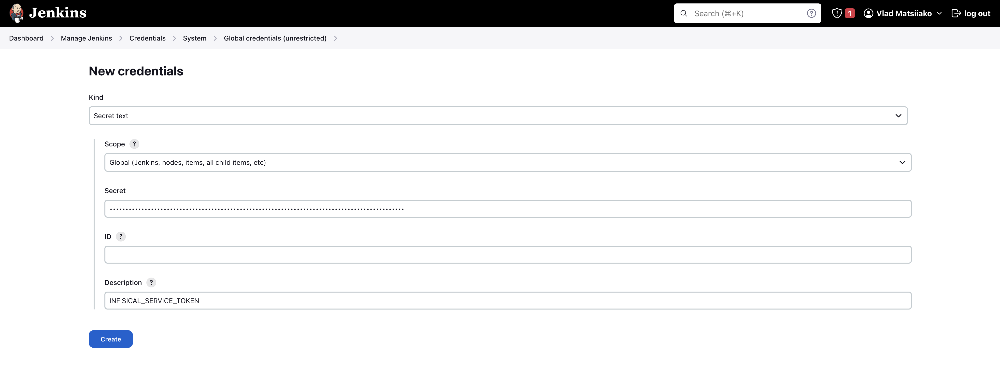

When you're done, you should have a credential similar to the one below:

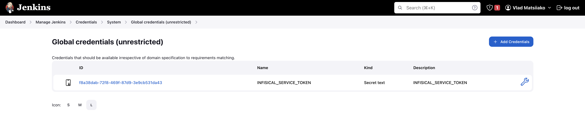


## Use Gsoc2 in a Freestyle Project

To use Gsoc2 in a Freestyle Project job, you'll need to expose the credential you created above in an environment variable. First, click New Item from the dashboard navigation sidebar:

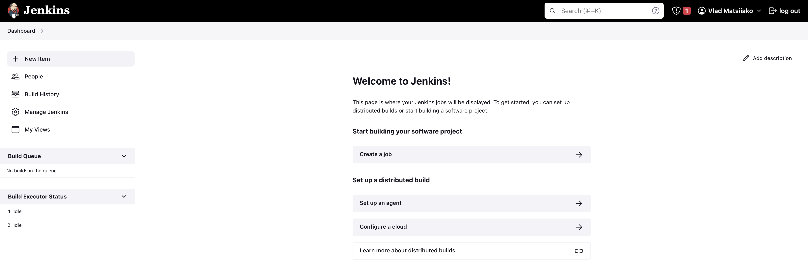

Enter the name of the job, choose the **Freestyle Project** option, and click **OK**.

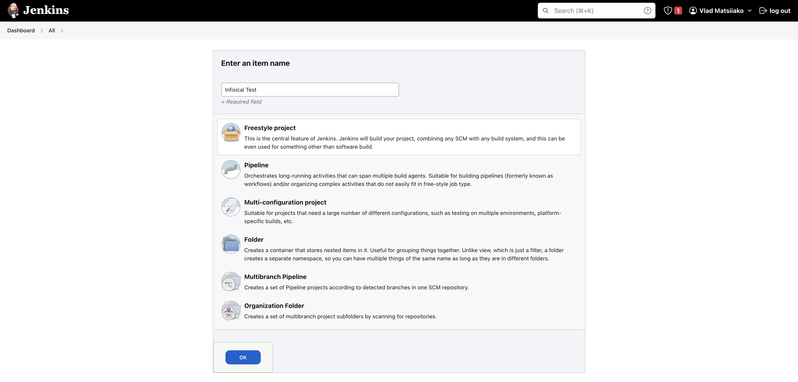

Scroll down to the **Build Environment** section and enable the **Use secret text(s) or file(s)** option. Then click **Add** under the **Bindings** section and choose **Secret text** from the dropdown menu.

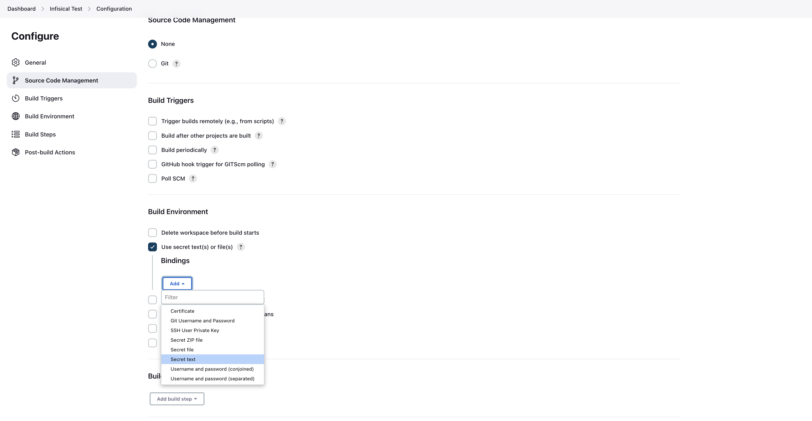

Enter GSOC2_SERVICE_TOKEN in the **Variable** field, select the **Specific credentials** option from the Credentials section and choose GSOC2_SERVICE_TOKEN from the dropdown menu.

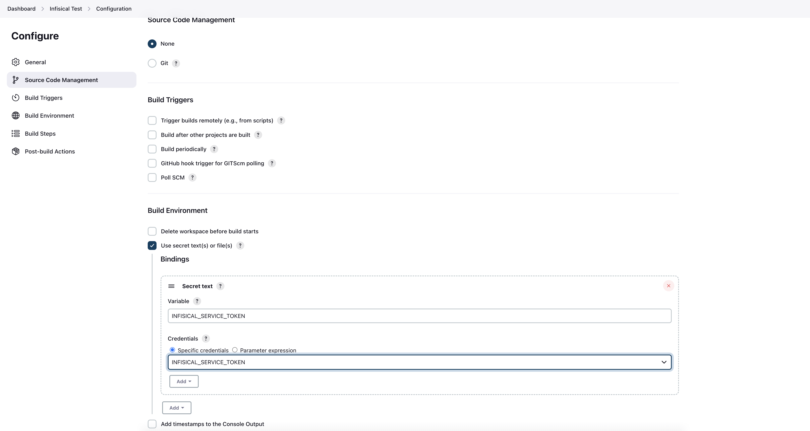

Scroll down to the **Build** section and choose **Execute shell** from the **Add build step** menu.

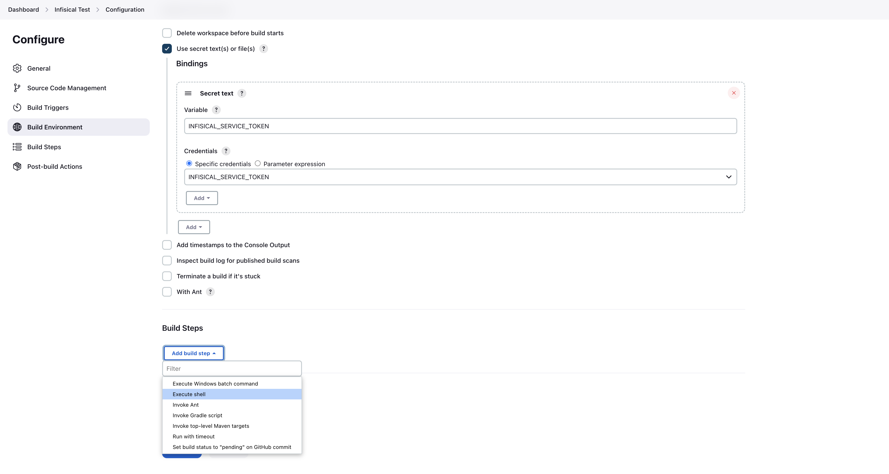

In the command field, enter the following command and click **Save**:

```
gsoc2 run -- printenv
```

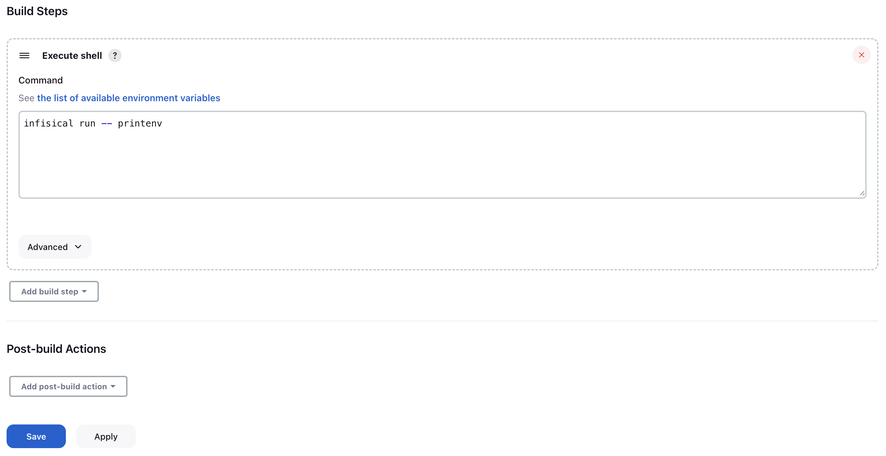

Finally, click **Build Now** from the navigation sidebar to test your new job.

<Info>
  Running into issues? Join Gsoc2's [community Slack](https://gsoc2.com/slack) for quick support.
</Info>


## Use Gsoc2 in a Jenkins Pipeline

To use Gsoc2 in a Pipeline job, you'll need to expose the credential you created above as an environment variable. First, click **New Item** from the dashboard navigation sidebar:


Enter the name of the job, choose the **Pipeline** option, and click OK.

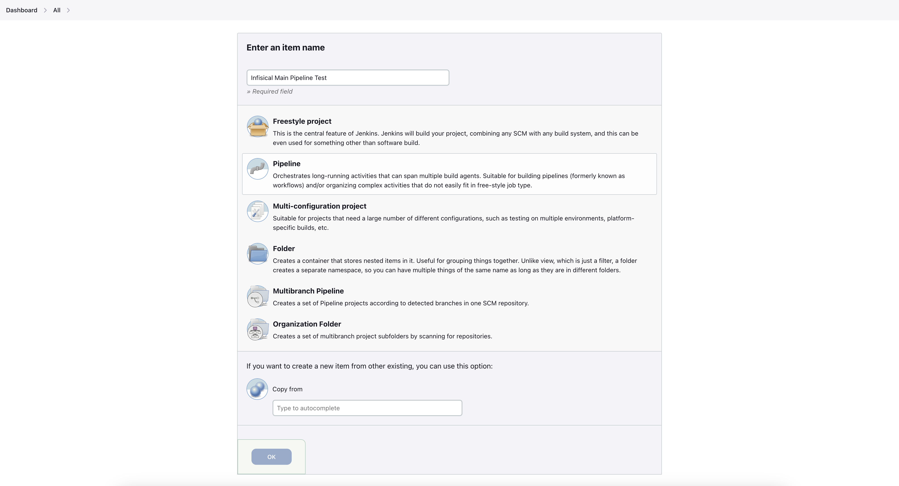

Scroll down to the **Pipeline** section, paste the following into the **Script** field, and click **Save**.

```
pipeline {
    agent any

    environment {
        GSOC2_SERVICE_TOKEN = credentials('GSOC2_SERVICE_TOKEN')
    }

    stages {
        stage('Run Gsoc2') {
            steps {
                sh("gsoc2 secrets")

                // doesn't work
                // sh("docker run --rm test-container gsoc2 secrets")

                // works
                // sh("docker run -e GSOC2_SERVICE_TOKEN=${GSOC2_SERVICE_TOKEN} --rm test-container gsoc2 secrets")

                // doesn't work
                // sh("docker-compose up -d")

                // works
                // sh("GSOC2_SERVICE_TOKEN=${GSOC2_SERVICE_TOKEN} docker-compose up -d")
            }
        }
    }
}
```

This is a very basic sample that you can work from. Jenkins injects the GSOC2_SERVICE_TOKEN environment variable defined in the pipeline into the shell the commands execute with, but there are some situations where that won't pass through properly – notably if you're executing docker containers on the executor machine. The examples above should give you some idea for how that will work.

Finally, click **Build Now** from the navigation sidebar to test your new job.
