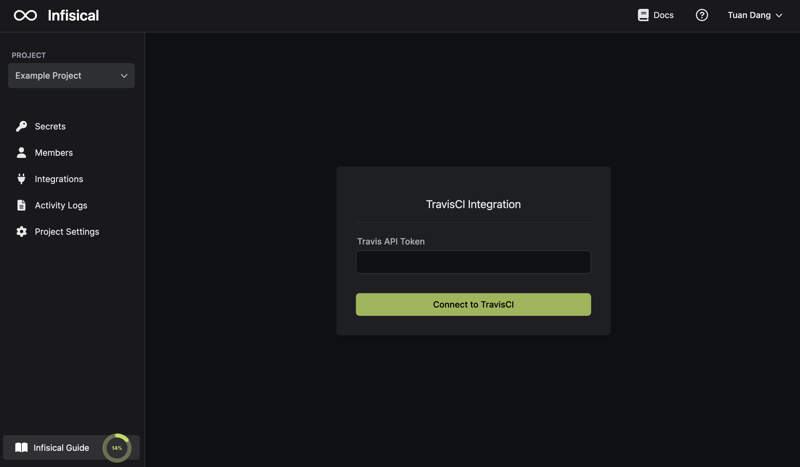
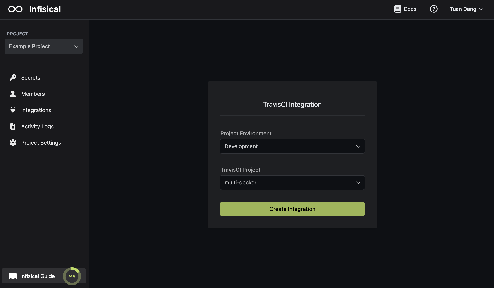
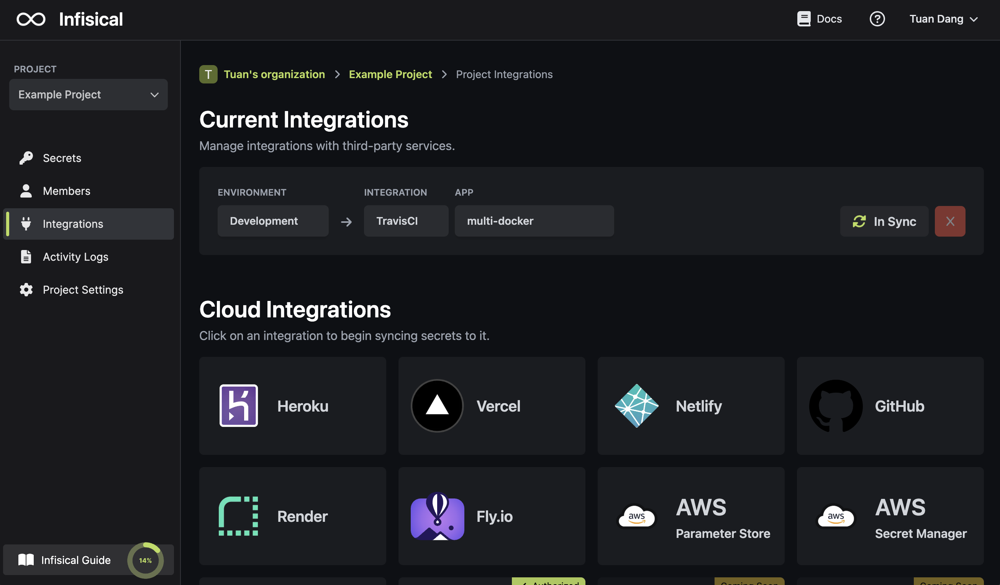

Prerequisites:

- Set up and add envars to [Gsoc2 Cloud](https://app.gsoc2.com)

## Navigate to your project's integrations tab

## Authorize Gsoc2 for Travis CI

Obtain your API token in User Settings > API authentication > Token

Press on the Travis CI tile and input your Travis CI API token to grant Gsoc2 access to your Travis CI account.

<Info>
  If this is your project's first cloud integration, then you'll have to grant
  Gsoc2 access to your project's environment variables. Although this step
  breaks E2EE, it's necessary for Gsoc2 to sync the environment variables to
  the cloud platform.
</Info>

## Start integration

Select which Gsoc2 environment secrets you want to sync to which Travis CI repository and press create integration to start syncing secrets to Travis CI.

