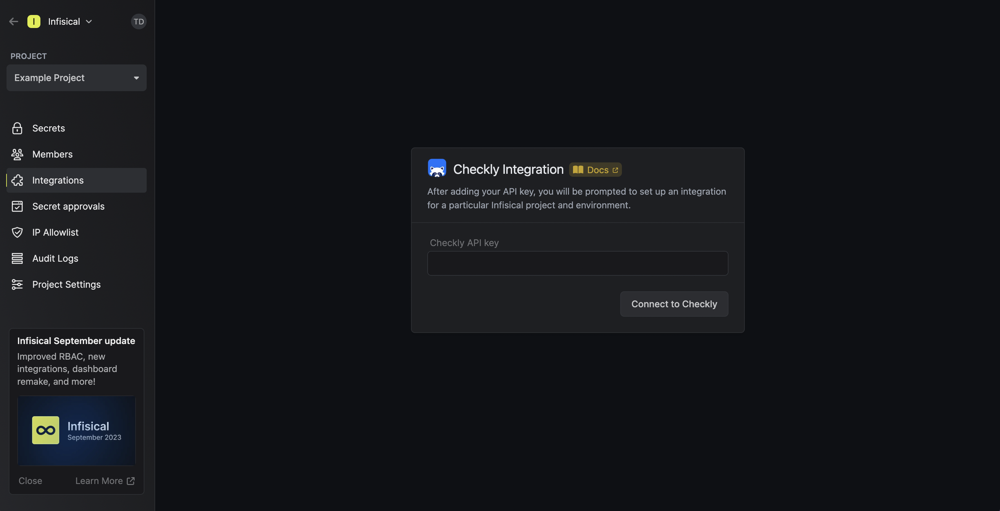
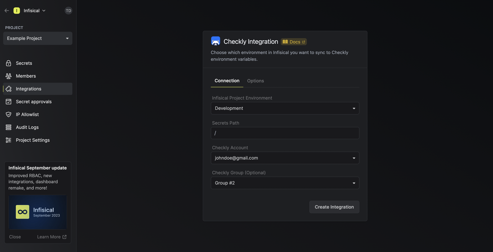
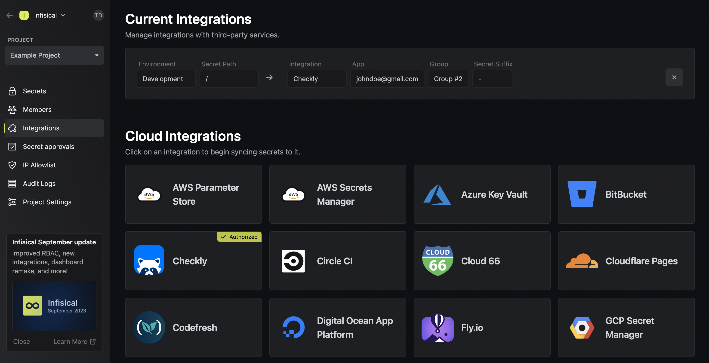

Prerequisites:

- Set up and add envars to [Gsoc2 Cloud](https://app.gsoc2.com)

## Navigate to your project's integrations tab

## Enter your Checkly API Key

Obtain a Checkly API Key in User Settings > API Keys.

Press on the Checkly tile and input your Checkly API Key to grant Gsoc2 access to your Checkly account.

<Info>
  If this is your project's first cloud integration, then you'll have to grant
  Gsoc2 access to your project's environment variables. Although this step
  breaks E2EE, it's necessary for Gsoc2 to sync the environment variables to
  the cloud platform.
</Info>

## Start integration

Select which Gsoc2 environment secrets you want to sync to Checkly and press create integration to start syncing secrets.

<Note>
  Gsoc2 integrates with Checkly's environment variables at the **global** and **group** levels.
  
  To sync secrets to a specific group, you can select a group from the Checkly Group dropdown; otherwise, leaving it empty will sync secrets globally.
</Note>

<Info>
  In the new version of the Checkly integration, you are able to specify suffixes that depend on the secrets' environment and path. 
  If you choose to do so, you should utilize such suffixes for ALL Checkly integrations – otherwise the integration system 
  might run into issues with deleting secrets from the wrong environments.
</Info>
