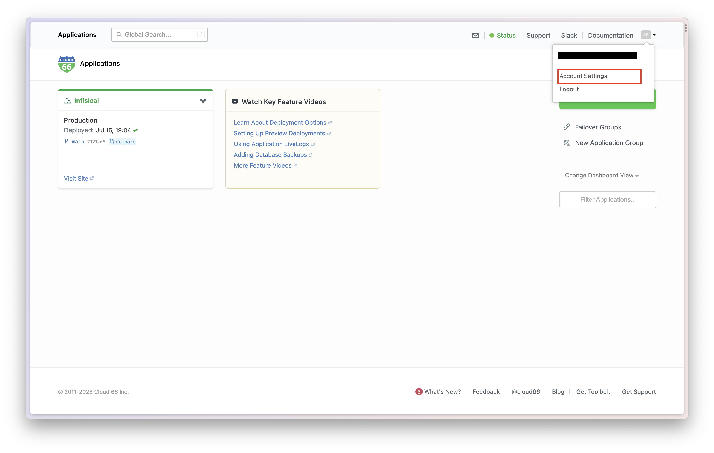
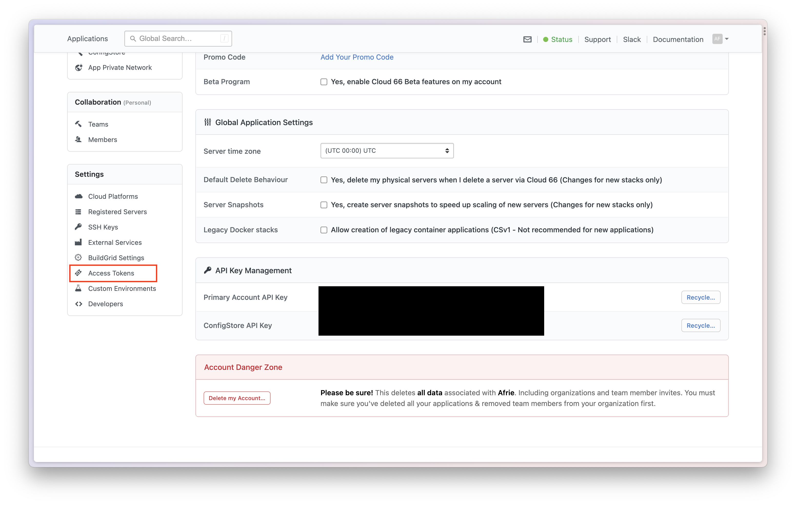
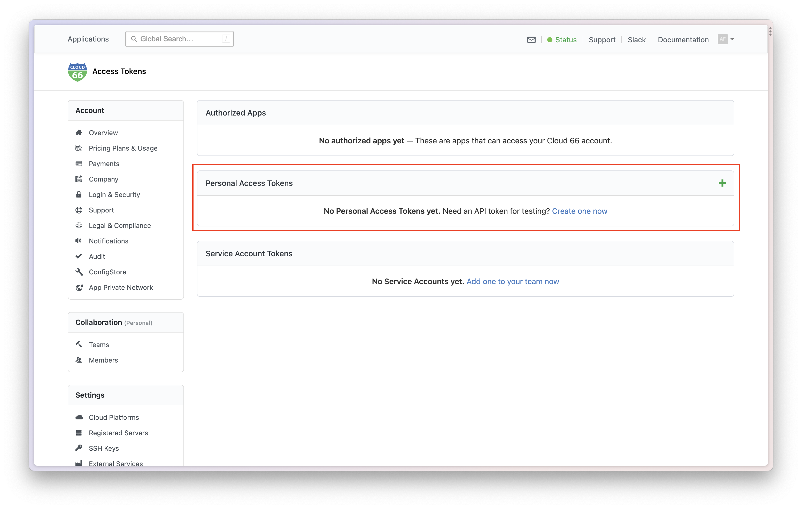
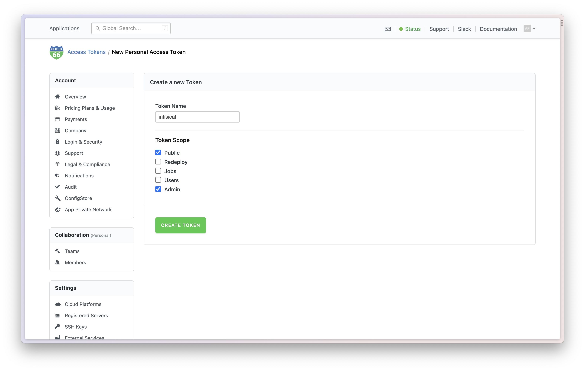
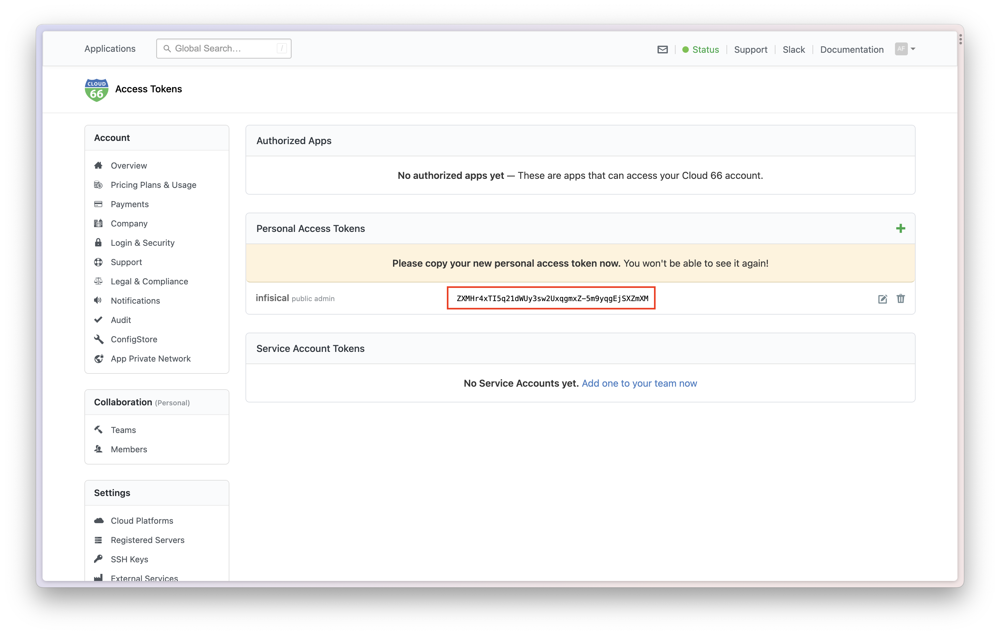
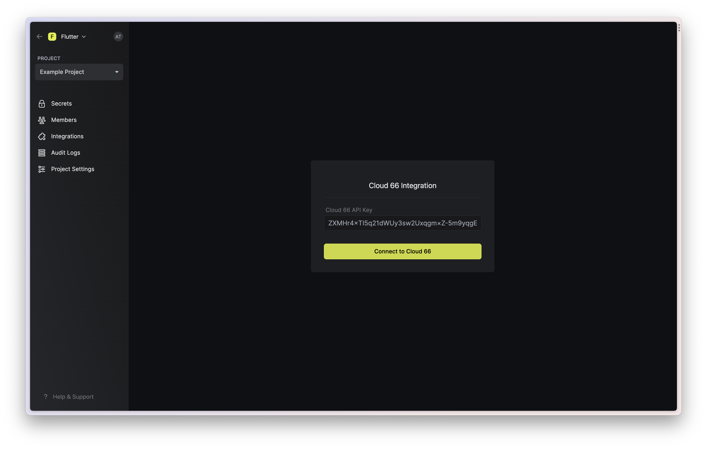
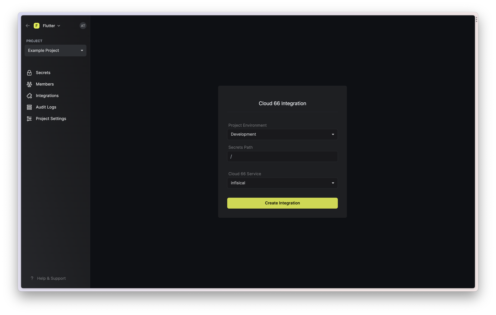
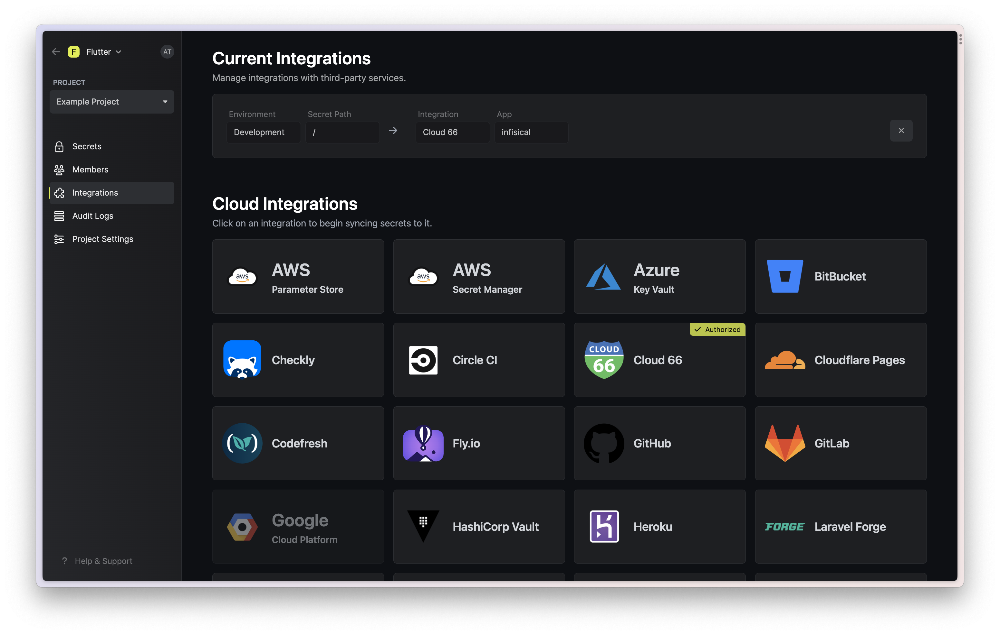

Prerequisites:

- Set up and add envars to [Gsoc2 Cloud](https://app.gsoc2.com)

## Navigate to your project's integrations tab

## Enter your Cloud 66 Access Token

In Cloud 66 Dashboard, click on the top right icon > Account Settings > Access Token

Create new Personal Access Token. 

Name it **gsoc2** and check **Public** and **Admin**. Then click "Create Token"

Copy and save your token.

### Go to Gsoc2 Integration Page

Click on the Cloud 66 tile and enter your API token to grant Gsoc2 access to your Cloud 66 account.

<Info>
  If this is your project's first cloud integration, then you'll have to grant
  Gsoc2 access to your project's environment variables. Although this step
  breaks E2EE, it's necessary for Gsoc2 to sync the environment variables to
  the cloud platform.
</Info>

Enter your Cloud 66 Personal Access Token here. Then click "Connect to Cloud 66".

## Start integration

Select which Gsoc2 environment secrets you want to sync to which Cloud 66 stacks and press create integration to start syncing secrets to Cloud 66.

<Warning>
  Any existing environment variables in Cloud 66 will be deleted when you start syncing. Make sure to add all the secrets into the Gsoc2 dashboard first before doing any integrations.
</Warning>

Done!

