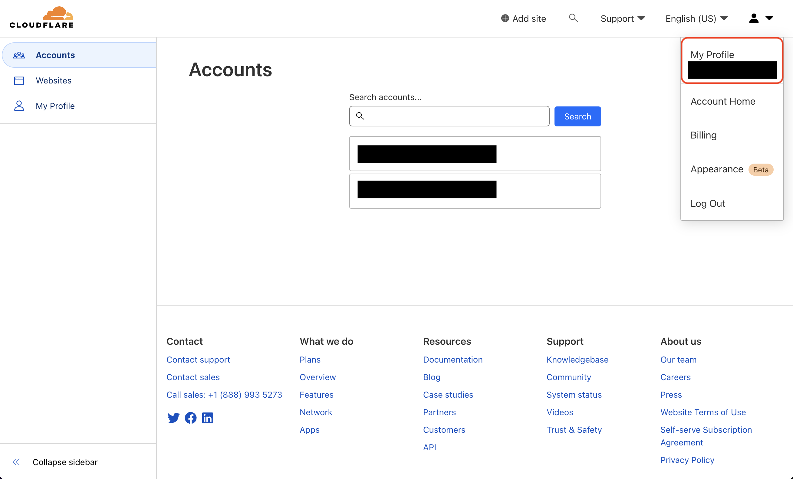
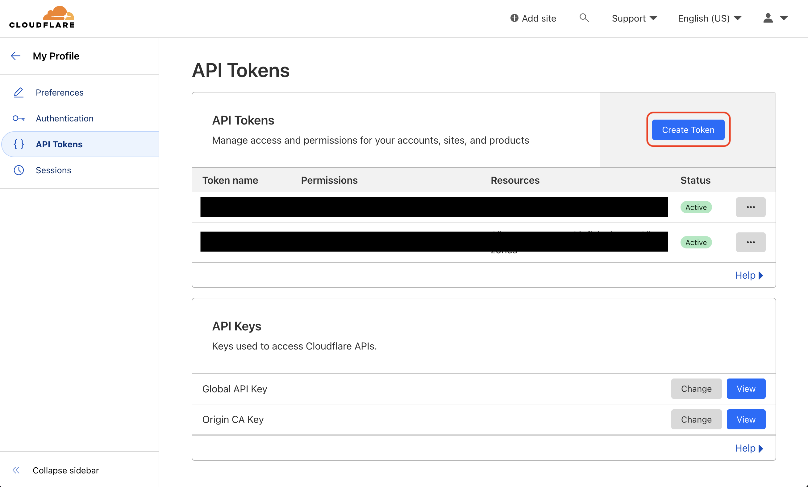
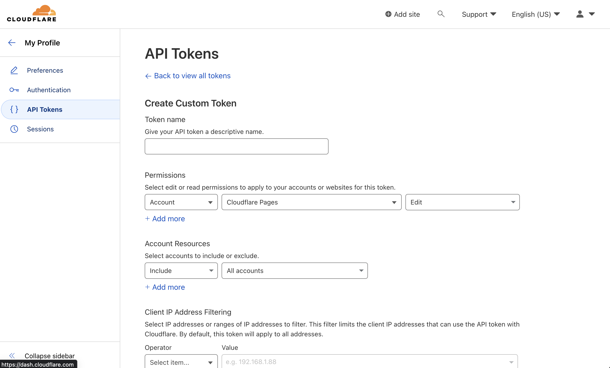
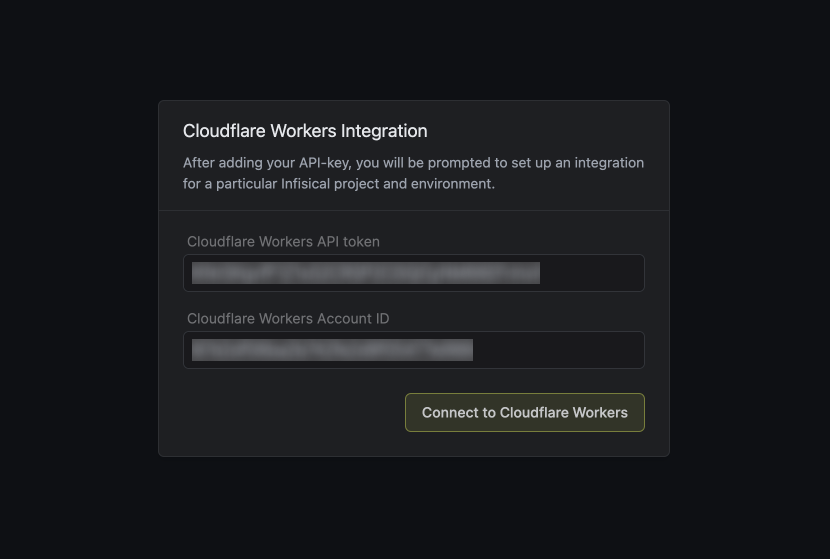
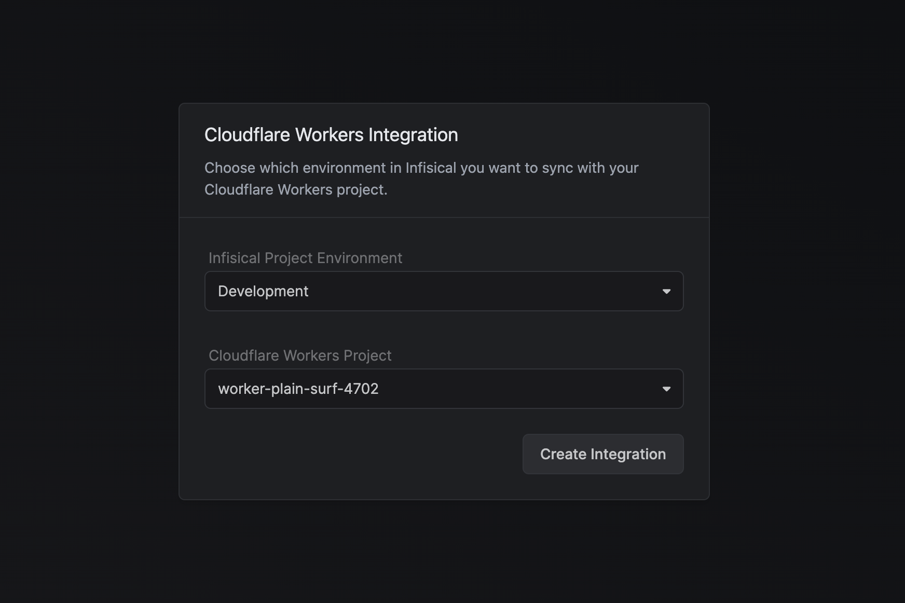

Prerequisites:

- Set up and add envars to [Gsoc2 Cloud](https://app.gsoc2.com)

## Navigate to your project's integrations tab

## Authorize Gsoc2 for Cloudflare Workers

Obtain a Cloudflare [API token](https://dash.cloudflare.com/profile/api-tokens) and [Account ID](https://developers.cloudflare.com/fundamentals/get-started/basic-tasks/find-account-and-zone-ids/):

1. Create a new [API token](https://dash.cloudflare.com/profile/api-tokens) in My Profile > API Tokens

2. Copy your [Account ID](https://developers.cloudflare.com/fundamentals/get-started/basic-tasks/find-account-and-zone-ids/) from Account > Workers & Pages > Overview

Press on the Cloudflare Workers tile and input your Cloudflare API token and account ID to grant Gsoc2 access to your Cloudflare Workers.

<Info>
  If this is your project's first cloud integration, then you'll have to grant
  Gsoc2 access to your project's environment variables. Although this step
  breaks E2EE, it's necessary for Gsoc2 to sync the environment variables to
  the cloud platform.
</Info>

## Start integration

Select which Gsoc2 environment secrets you want to sync to Cloudflare Workers and press create integration to start syncing secrets.

