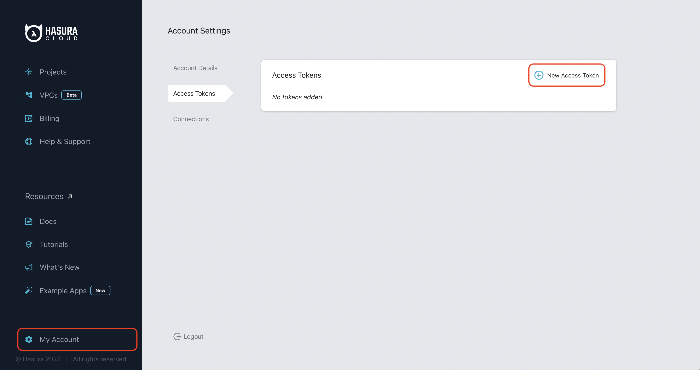
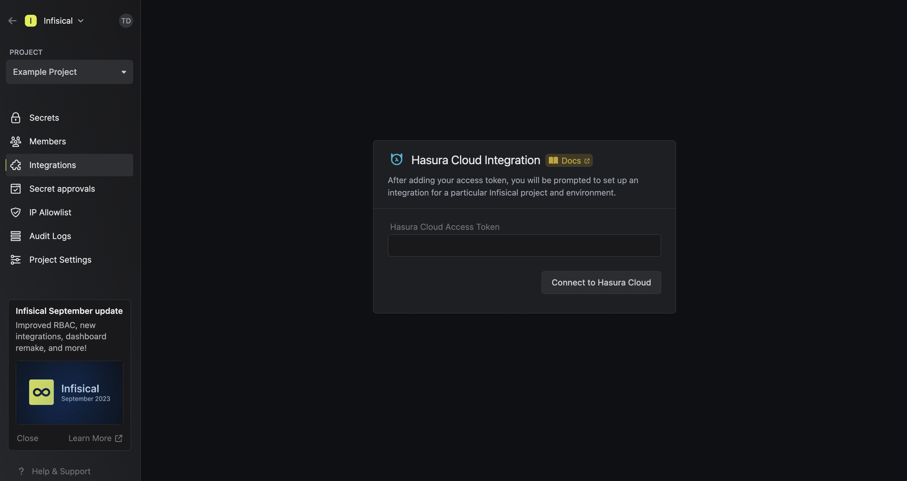
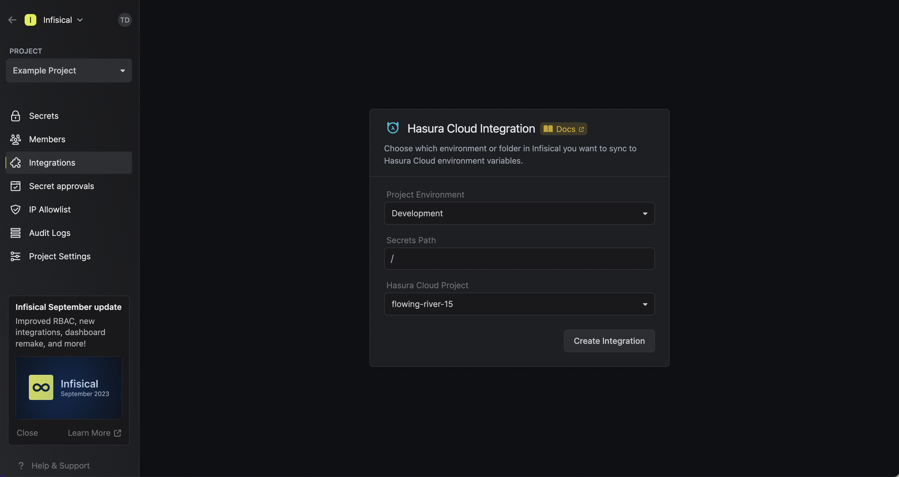
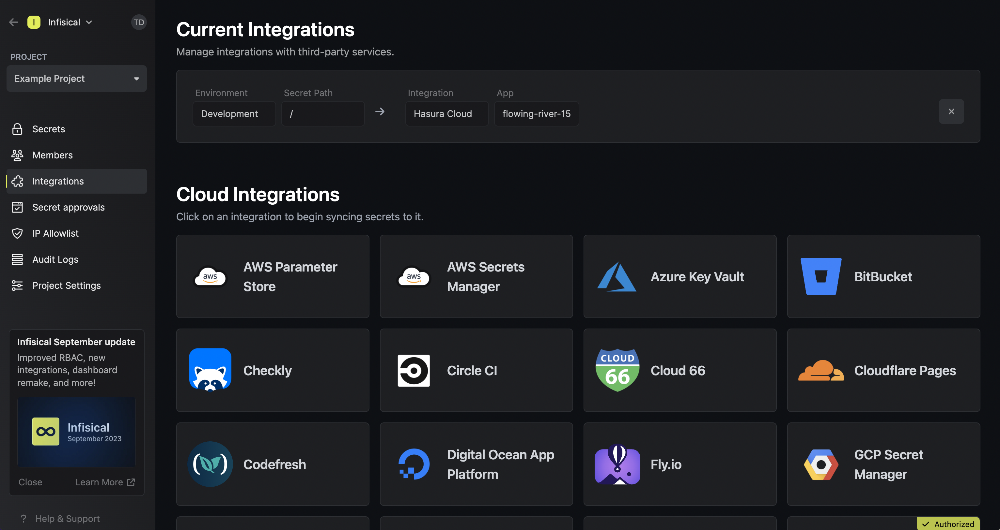

Prerequisites:

- Set up and add envars to [Gsoc2 Cloud](https://app.gsoc2.com)

## Navigate to your project's integrations tab

## Enter your Hasura Cloud Access Token

Obtain a Hasura Cloud Access Token in My Account > Access Tokens

Press on the Hasura Cloud tile and input your Hasura Cloud access token to grant Gsoc2 access to your Hasura Cloud account.

<Info>
  If this is your project's first cloud integration, then you'll have to grant
  Gsoc2 access to your project's environment variables. Although this step
  breaks E2EE, it's necessary for Gsoc2 to sync the environment variables to
  the cloud platform.
</Info>

## Start integration

Select which Gsoc2 environment secrets you want to sync to which Hasura Cloud project and press create integration to start syncing secrets to Hasura Cloud.

