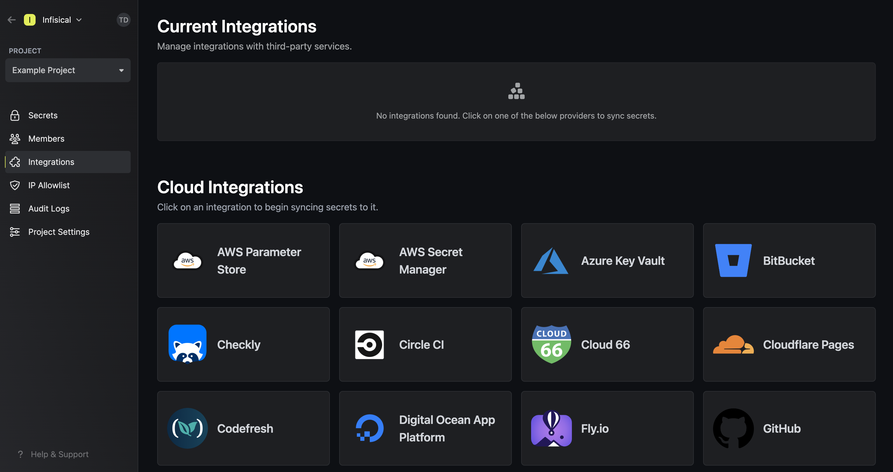
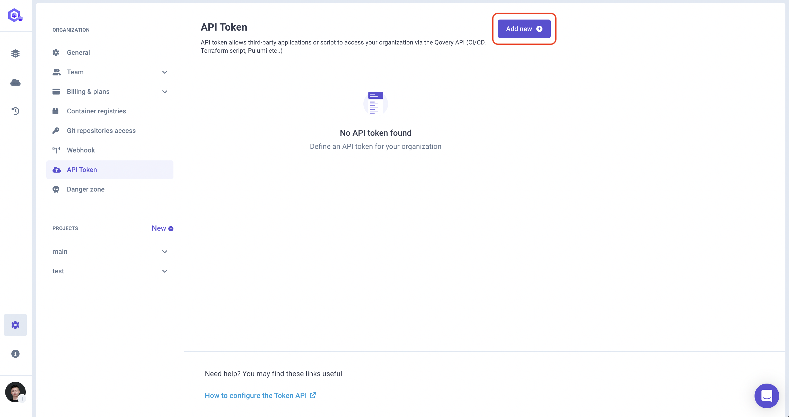
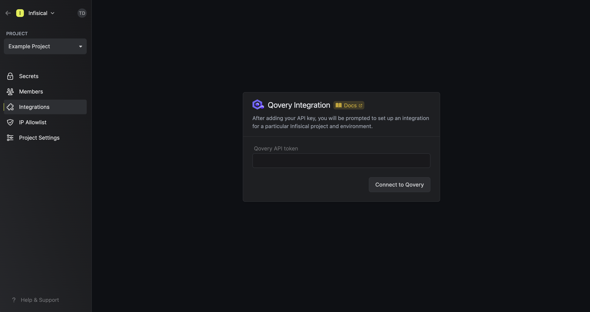
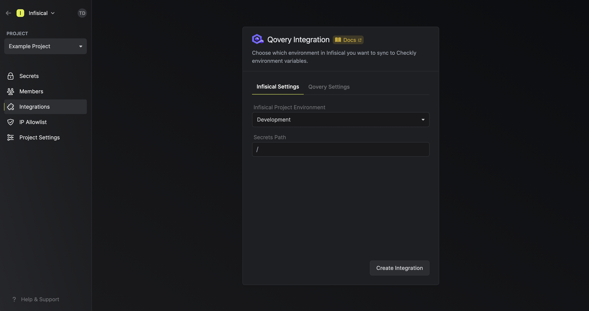
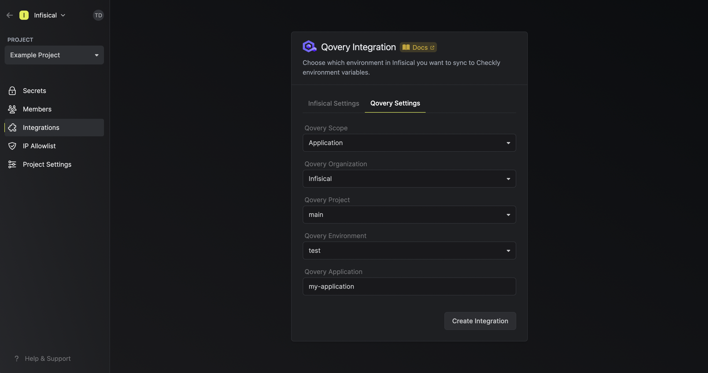
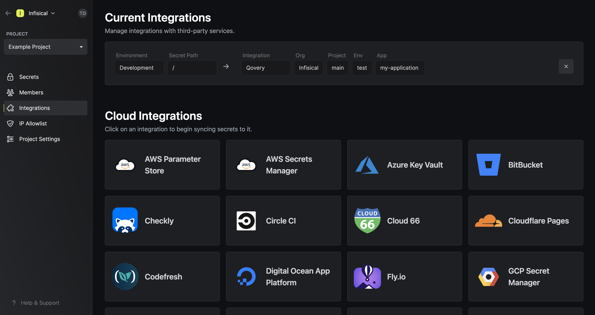

Prerequisites:

- Set up and add envars to [Gsoc2 Cloud](https://app.gsoc2.com)

## Navigate to your project's integrations tab

## Enter your Qovery API Token

Obtain a Qovery API Token in Settings > API Token.

Press on the Qovery tile and input your Qovery API Token to grant Gsoc2 access to your Qovery account.

<Info>
  If this is your project's first cloud integration, then you'll have to grant
  Gsoc2 access to your project's environment variables. Although this step
  breaks E2EE, it is necessary for Gsoc2 to sync the environment variables to
  the cloud platform.
</Info>

## Start integration

Select which Gsoc2 environment secrets you want to sync to Qovery and press create integration to start syncing secrets.

<Note>
  Gsoc2 supports syncing secrets to various Qovery scopes including applications, jobs, or containers.
</Note>

