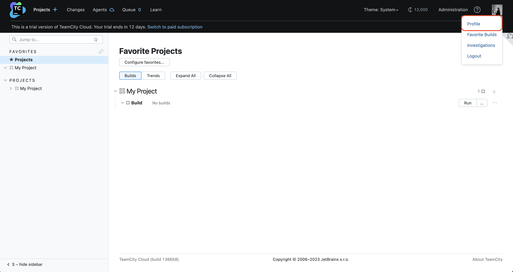
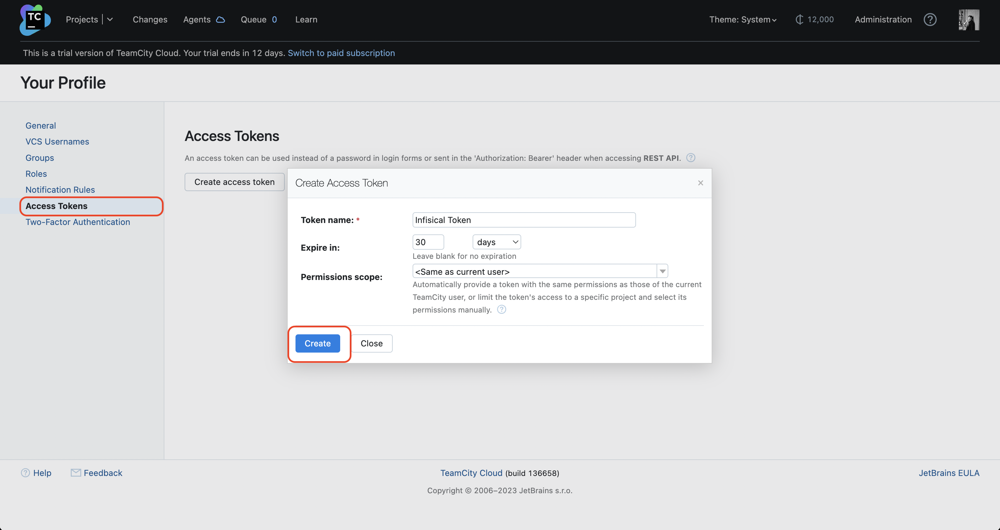
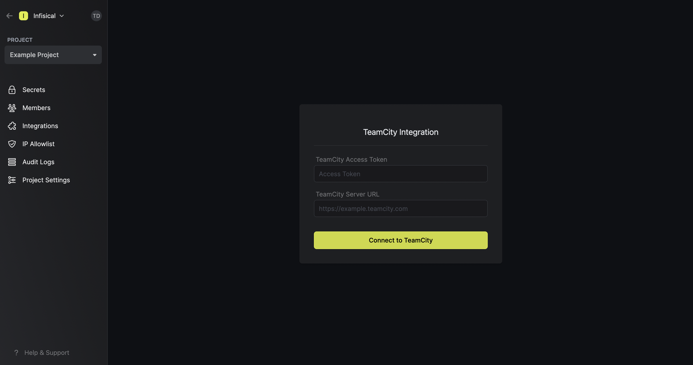
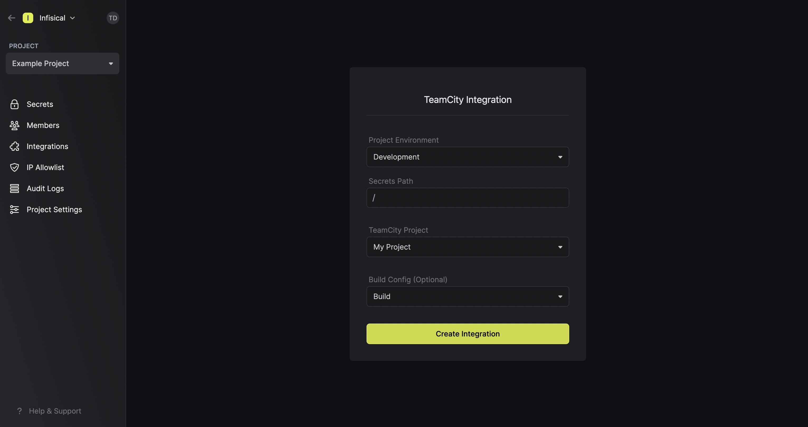
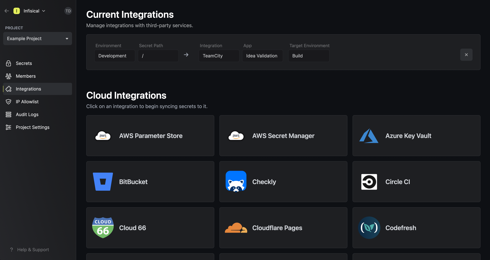

Prerequisites:

- Set up and add envars to [Gsoc2 Cloud](https://app.gsoc2.com)

## Navigate to your project's integrations tab

## Enter your TeamCity Access Token and Server URL

Obtain a TeamCity Access Token in Profile > Access Tokens

<Note>
  For this integration to work, the TeamCity Access Token must either have the
  **Same as current user** account-wide permission enabled or, if **Limit per project**
  is selected, then it must at minimum have the **View build configuration settings** and **Edit project** permissions enabled.
</Note>

<Info>
  If this is your project's first cloud integration, then you'll have to grant
  Gsoc2 access to your project's environment variables. Although this step
  breaks E2EE, it's necessary for Gsoc2 to sync the environment variables to
  the cloud platform.
</Info>

Press on the TeamCity tile and input your TeamCity Access Token and Server URL to grant Gsoc2 access to your TeamCity account.

## Start integration

Select which Gsoc2 environment secrets you want to sync to which TeamCity project (and optionally build configuration) and press create integration to start syncing secrets to TeamCity.

<Note>
  Gsoc2 integrates with both TeamCity's project-level and build configuration-level environment variables.
  
  To sync secrets to a specific build configuration in a TeamCity project, you can select a build configuration from the **TeamCity Build Config** dropdown; otherwise, leaving it empty will sync secrets to TeamCity at the project-level.
</Note>

