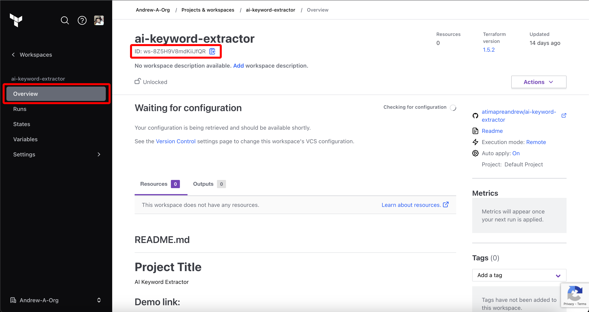

Prerequisites:

- Set up and add envars to [Gsoc2 Cloud](https://app.gsoc2.com)

## Navigate to your project's integrations tab

## Enter your Terraform Cloud API Token and Workspace Id

Obtain a Terraform Cloud API Token in User Settings > Tokens

Obtain your Terraform Cloud Workspace Id in Projects & Workspaces > Workspace > ID

Press on the Terraform Cloud tile and input your Terraform Cloud API Token and Workspace Id to grant Gsoc2 access to your Terraform Cloud account.

<Info>
  If this is your project's first cloud integration, then you'll have to grant
  Gsoc2 access to your project's environment variables. Although this step
  breaks E2EE, it's necessary for Gsoc2 to sync the environment variables to
  the cloud platform.
</Info>

## Start integration

Select which Gsoc2 environment secrets and Terraform Cloud variable type you want to sync to which Terraform Cloud workspace/project and press create integration to start syncing secrets to Terraform Cloud.

